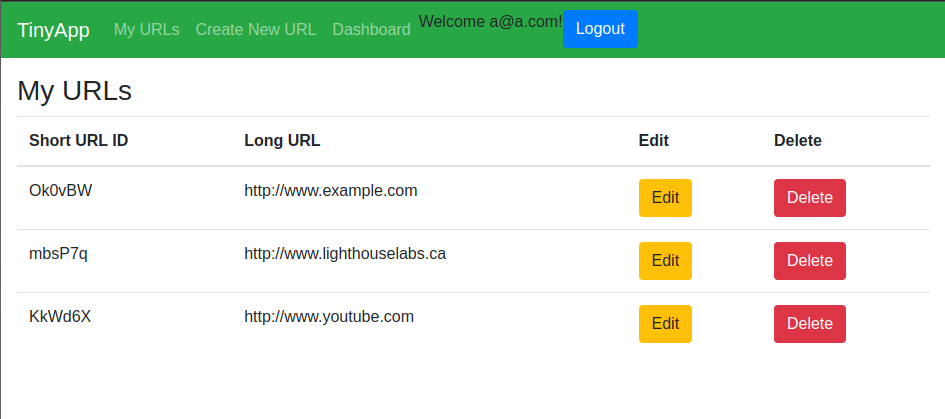

# TinyApp Project

TinyApp is a full stack web application built with Node and Express that allows users to shorten long URLs (à la bit.ly).

## Final Product

## Dependencies

- Node.js
- Express
- EJS
- bcryptjs
- cookie-session
- cookie-parser
- method-override

## Getting Started

- Install all dependencies (using the `npm install` command).
- Run the development web server using the `node express_server.js` command.

## Features

- User registration/login, with password recovery using a security question and answer. (Answer is hashed using bcrypt)
- User Dashboard featuring changing email, changing password, and deleting account. (Deleting account will also delete every URL registered under user ID)
- Shorten URL, edit URL corresponding to short URL id and delete URL from database
- Keeps track of the number of raw page views and logs it. (Unique visitor counter not implemented)